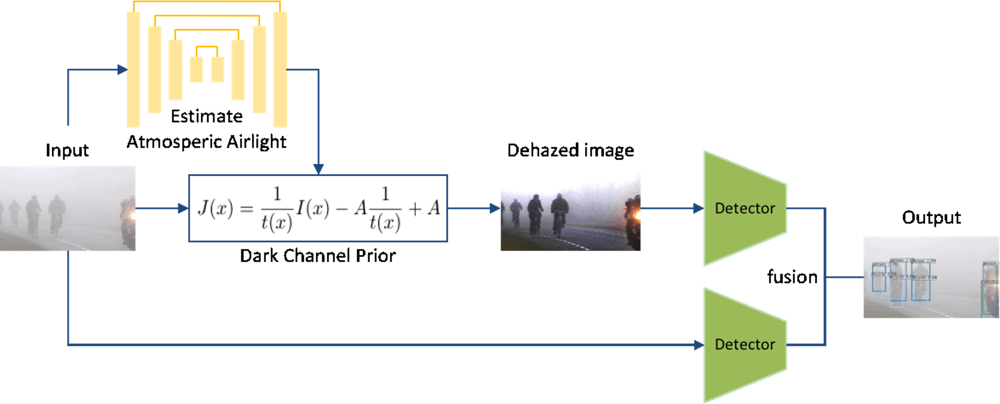

# Blur imaeg detection

Implementation of blur image detection.


## Data

RESIDE-β Dataset: a real-world hazy images and bounding box coordinates.

## Model



## Getting started
- Evalution
```
python test.py 
```

- Train
```
python train.py
```
